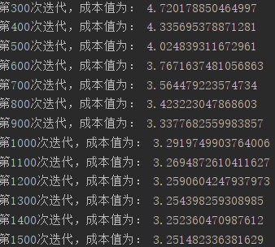

## Minist手写数字识别

##### PS：这里有一个MINIST的[立体模型](<http://scs.ryerson.ca/~aharley/vis/conv/>)

### 数据来源

> 数据是从MINIST数据集的官网获取的
>
> 读取数据用到的是TensorFlow官网的数据输入，之后考虑自己实现

### 数据分析

> 该数据分为训练集跟测试集，每个数据单元分为手写数字的图片跟对应的标签，
>
> 每一张图片包含28像素X28像素，可以用一个数字数组来表示这张图片，将这个数组展开为28x28=784的数组，如何展开这个数组（数字间的顺序）不重要，只要保持各个图片采用相同的方式展开，MNIST数据集的图片就是在784维向量空间里面的点
>
> 在MNIST训练数据集中，`mnist.train.images` 是一个形状为 `[60000, 784]` 的张量，第一个维度数字用来索引图片，第二个维度数字用来索引每张图片中的像素点。在此张量里的每一个元素，都表示某张图片里的某个像素的强度值，值介于0和1之间。
>
> MNIST数据集的标签是介于0到9的数字，用来描述给定图片里表示的数字。此处用的是one-hot 向量。一个one-hot向量除了某一位的数字是1以外其余各维度数字都是0。在此处数字n将表示成一个只有在第n维度（从0开始）数字为1的10维向量。

### 具体过程

> 过程跟猫识别类似
>
> **1. 初始化网络参数**
>
> **2. 前向传播**
>
> ​	2.1 计算线性求和部分
>
> ​	2.2 计算激活函数部分
>
> ​	2.3 结合求和函数与激活函数
>
> **3. 计算LOSS**
>
> **4. 反向传播**
>
> ​	4.1 线性部分的反向传播
>
> ​	4.2 激活函数的反向传播
>
> ​	4.3 结合线性部分跟激活函数的方向传播公式
>
> **5.更新参数**
>
> **6. TO 1**
>
> 然后就是导入参数进行训练
>
> 然后就出现了第一个问题，我直接参照猫识别那个进行数据导入，然后数据转换时Y的reshape出错了。如下
>
> `cannot reshape array of size 550000 into shape (1,55000)`
>
> reshape的参数没设置对。
>
> 直接把后一个参数*10试图进行下去，然后发现，计算时矩阵的长宽就变了。然后回去分析猫猫那个的y时怎么设置的。看到是把长宽互换了，所以把第一个参数设置为10，查看效果，发现还是出现问题。在查了很久后突然意识到可能中间计算过程出错了。
>
> 所以认真检查了一遍，发现，原来是有一个函数的参数写错了，我。。。必须得认真写。
>
> 终于，开始训练了。
>
> 训练速度有点感人。开始时就用了两层。还是很慢。然后考虑GPU加速一下。
>
> 发现没有用到tensorflow，就考虑numpy直接gpu加速
>
> 搜索到可以使用minpy来代替numpy实现加速，当然得先安装mxnet（这个得对应cuda版本）
>
> 然后发现我用的是3.7，而这个包只支持到3.6
>
> 我cuda用anaconda一键安装的，版本太高，暂时只出现了一点结果
>
> 安装minpy时还把环境搞炸了，幸亏用的虚拟环境。
>
> 重新搭建一下环境后继续跑。

> 这里只有一个隐藏层，隐藏层节点设置的是50，因为实在很慢，都没结果，这里只可以看到成本下降。

### 2019.4.25更新

>  安装mxnet发现用不了，minpy里什么函数也没有，只能放那让他慢慢训练，其实也不是太慢。
>
>  训练忘了发现忘了保存参数，忘了加准确率测试，添加之后再次训练
>
>  训练间隙看了下kaggle上都是用的keras框架，有一定的参考性，他们训练集划分都是将图片转成二维，而我在这直接拿一维处理的，尝试修改一下查看效果

### 出现结果了

>第 0 次迭代，成本值为： 6.931943729651422
>第 100 次迭代，成本值为： 5.204537838222873
>第 200 次迭代，成本值为： 3.456266929748742
>第 300 次迭代，成本值为： 3.258189000932334
>第 400 次迭代，成本值为： 3.2516485961068087
>第 500 次迭代，成本值为： 3.250937309512815
>第 600 次迭代，成本值为： 3.2508430127123575
>第 700 次迭代，成本值为： 3.2508298446030834
>第 800 次迭代，成本值为： 3.2508277958374046
>第 900 次迭代，成本值为： 3.2508273352197663
>训练集准确度为: 0.38825454545454546
>测试集准确度为: 0.3931

可以看到很不理想，分析了一下，可能是参数初始化或者数据集太大的缘故，考虑分批进行处理，同时学习率跟参数初始化调整一下